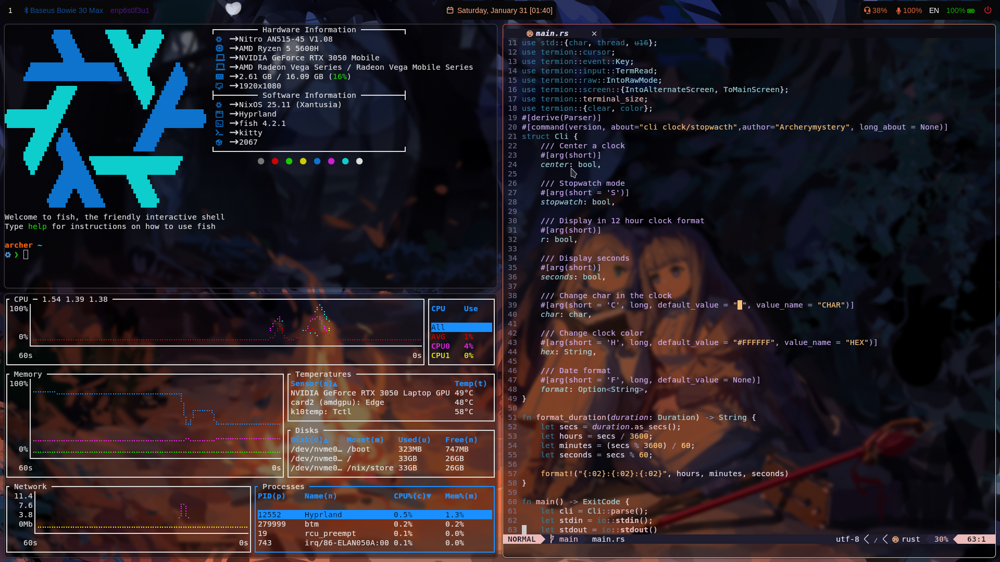
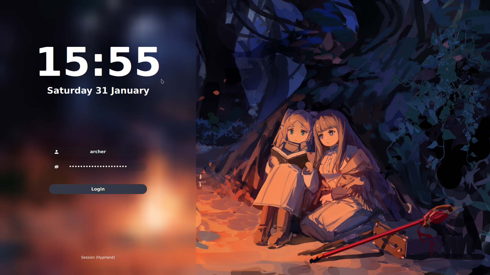
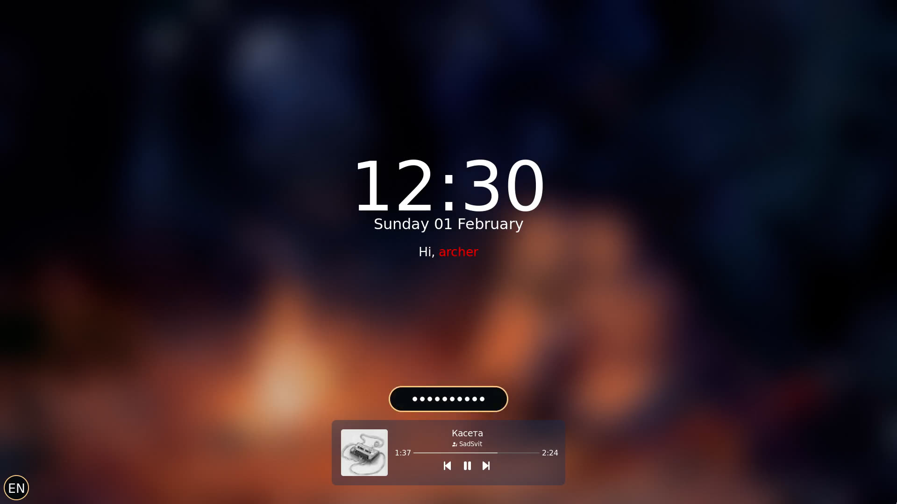

<h1 align="center">
     
    
      Archerymystery's Flakes 
    
    

      

      

       
        
              
         
   

</h1>
 

    Sddm

     

    Hyprlock

     

    Launcher

     

    Notifications

     

# Software I Use
| Syntax | Description |
| ----------- | ----------- |
| Window Manager | [Hyprland](https://github.com/hyprwm/Hyprland) |
| Status Bar | [Waybar](https://github.com/Alexays/Waybar) |
| Terminal | [kitty](https://github.com/kovidgoyal/kitty) |
| Launcher | [wofi](https://hg.sr.ht/~scoopta/wofi) |
| Browser | [Firefox](https://www.mozilla.org/uk/firefox/) |
| File Manager | [yazi](https://github.com/sxyazi/yazi) |
| Notifications | [mako](https://github.com/emersion/mako) |
| Image Viewer | [imv](https://sr.ht/~exec64/imv/) |
| Video Player | [mpv](https://github.com/mpv-player/mpv) |
| Lockscreen | [hyprlock](https://github.com/hyprwm/hyprlock)|
| Wallpaper Utility | [hyprpaper](https://github.com/hyprwm/hyprpaper)|
| System Monitor | [bottom](https://github.com/ClementTsang/bottom) |
| Code Redactor | [neovim](https://github.com/neovim/neovim)

