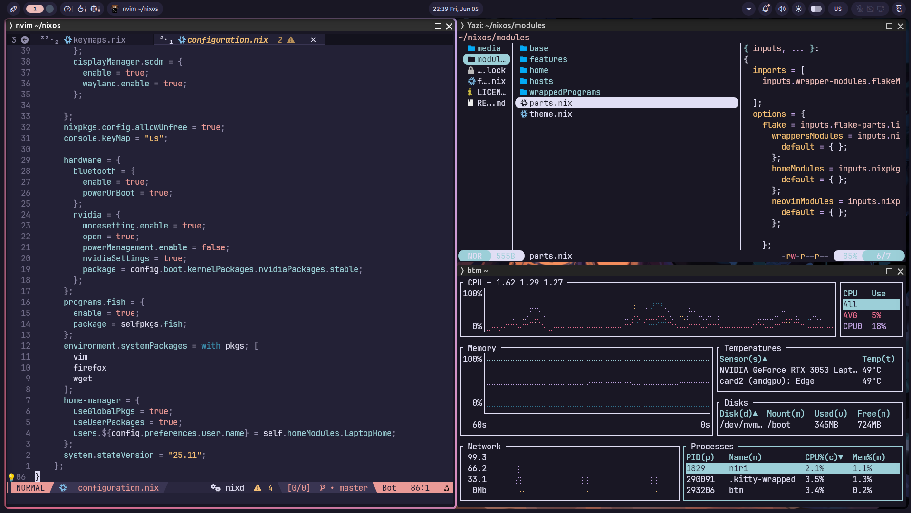

<h1 align="center">
     
    
      Archerymystery's Flakes 
    
    

      

      

       
        
              
         
   

</h1>

# Software I Use
| Syntax | Description |
| ----------- | ----------- |
| Window Manager | [niri](https://github.com/niri-wm/niri) |
| Desktop shell| [noctalia](https://github.com/noctalia-dev/noctalia-shell) |
| Terminal | [kitty](https://github.com/kovidgoyal/kitty) |
| Browser | [Firefox](https://www.mozilla.org/uk/firefox/) |
| File Manager | [yazi](https://github.com/sxyazi/yazi) |
| Image Viewer | [imv](https://sr.ht/~exec64/imv/) |
| Video Player | [mpv](https://github.com/mpv-player/mpv) |
| System Monitor | [bottom](https://github.com/ClementTsang/bottom) |
| Code Redactor | [neovim](https://github.com/neovim/neovim) with [NVF](https://github.com/NotAShelf/nvf.git)|

